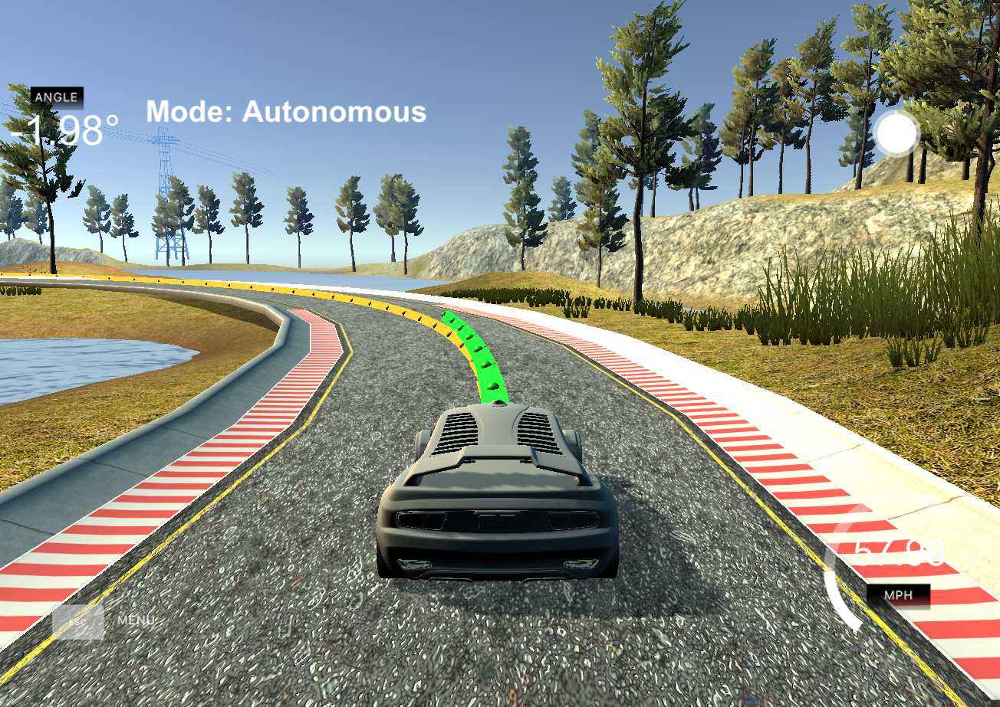
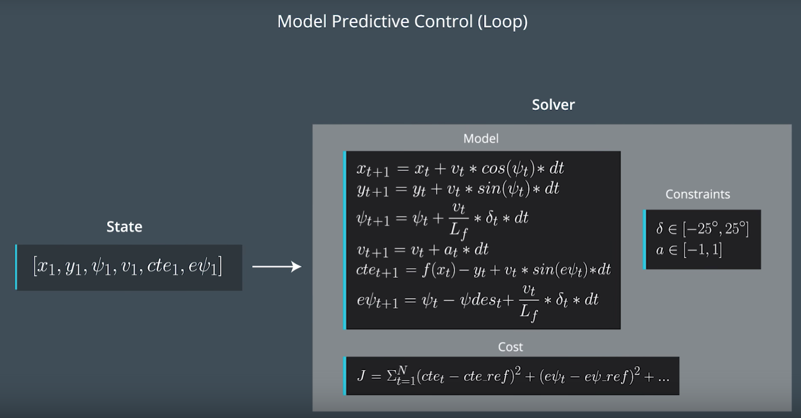

# CarND-Controls-MPC
Self-Driving Car Engineer Nanodegree Program

# *Model Predictive Controller Project*

## Intro



In this project I use the Model Predictive Control (MPC) approach out of the udacity lessons. MPC is a common approach to handle dynamic systems and especially system death times. For developing the MPC I used the udacity simulator which communicates telemetry and track waypoint data via websocket, by sending steering and acceleration commands back to the simulator. 

The general data and calculation flow looks like this:
* Getting a json object which contains the following:
  * Almost perfect waypoints (ptsx, ptsx) from the middle of the lane as reference path 
  * velocity in mph at current time point
  * car position in x and y direction at current time point
  * car orientation at current time point
  * car steering angle at current time point
  * car acceleration at current time point

* Predict the car's state 100 ms to take latency into account
* Transform waypoints into car's cooridnate system
* Fit a polynomial third order into given waypoints and calclulate the coefficients
* Calculate the current cross track error and orientation error
* Enter the vehicle state and coefficients to the solver method
* The Solver method optimizes the steering angle and acceleration using a kinematic model
* Send the optimized steering angle and acceleration to the simulated car model

## Rubric Points

- **The Model**: *Student describes their model in detail. This includes the state, actuators and update equations.*

The model looks like below:


State :
  1. A six state model input vector:
  * [x coordinate, y coordinate, orientation angle (psi), velocity v, cross track error, psi error]
  2. Update equations based on kinematic laws shown in the pictur above
  3. The cost function for optimizing the control values a and delty
  4. The control value contrains given by the vehicle  

The model enable the solver method to predict many vehicle trajectories iteration over time and vary tis trajectory by modify the control input. While verying the control inputs, the cost functions evaluate eacht possible trajectory against given criterias


- **Timestep Length and Elapsed Duration (N & dt)**: *Student discusses the reasoning behind the chosen N (timestep length) and dt (elapsed duration between timesteps) values. Additionally the student details the previous values tried.*

The values chosen for N and dt are 9 and 0.1. These values mean that the optimizer is considering a 0.9 second in which to determine a corrective trajectory. Adjusting either N or dt (even by small amounts) often produced erratic behavior. In my opinion it better to start with small N, so that the computation power is taking into account. Only increase N if u feel that the vehicle gets problems to handle strong curvy situations.

I tried also N= 7,8,10,11,12,13,15 and dt = 0.05,0.12

So I liked the simulation flow when choosing N as small as possible. but with 7 I got problems handle the curve before the bridge. My choosed dt depend on the first approach to take latency into account(more on this below)


- **Polynomial Fitting and MPC Preprocessing**: *A polynomial is fitted to waypoints. If the student preprocesses waypoints, the vehicle state, and/or actuators prior to the MPC procedure it is described.*

Before calling the MPC method I do two things (main.cpp line ).
- transform the waypoints into vehicle coordinate system like shown below:
```c++
// Call of the transformation
transform_to_vehicle_coordinate(ptsx, ptsy, ptsxVec, ptsyVec, px, py,
                                          psi);
// Method definition
for (uint64_t i = 0; i < ptsx.size(); i++) {
    double dx = ptsx[i] - px;
    double dy = ptsy[i] - py;
    ptsxVec[i] = dx * cos(-psi) - dy * sin(-psi);
    ptsyVec[i] = dx * sin(-psi) + dy * cos(-psi);
  }
```
This simplifies the process to fit a polynomial to the waypoints because the vehicle's x and y coordinates are now at the origin (0, 0) and the orientation angle is also zero.

- predict the vehcile state by 100 ms --> more on this below 

- **Model Predictive Control with Latency**: *The student implements Model Predictive Control that handles a 100 millisecond latency. Student provides details on how they deal with latency.*

This was a hard point. So first I tried to feedback the previous optimized control values into the model while tuning the iteration duration to the same value as the expected latency. So this approach did not work for me. As a result the waypoint going crazy and in this way my reference path was no longer usable for the solver to optimize on it. 

My second apporach as mentioned one question above was to predict the vehicle states for the time of latency into the future. 
```c++
  double steer_value = j[1]["steering_angle"];
  double throttle_value = j[1]["throttle"];
  px += v * cos(psi) * 0.1;
  py += v * sin(psi) * 0.1;
  psi -= (v * steer_value * 0.1) / 2.67;
  v += throttle_value * 0.1;
```
Ater prediction I transformed the waypoints into coordinate system. There are a lot of discussion based ont he question "tranform waypoints before or after prediction". For me first predict works very well.

To optimize the solver optimization process I tune the weights of my cost functions manually and depending on the suggestions out of the MPC lesson. Of cause I tried a lot to get a acceptable control behavior. Additionally one could try to tune the cost function weights using a tuning algorithmn like TWIDDLE.

```c++
// The part of the cost based on the reference state.
    for (uint64_t i = 0; i < N; i++) {
      fg[0] += CppAD::pow(vars[cte_start + i], 2);
      fg[0] += 10 * CppAD::pow(vars[epsi_start + i], 2);
      fg[0] += CppAD::pow(vars[v_start + i] - ref_v, 2);
    }
    for (uint64_t i = 0; i < N - 1; i++) {
      fg[0] += 10 * CppAD::pow(vars[delta_start + i], 2);
      fg[0] += CppAD::pow(vars[a_start + i], 2);
    }
    for (uint64_t i = 0; i < N - 2; i++) {
      fg[0] += 700 * CppAD::pow(vars[delta_start + i + 1] - vars[delta_start + i], 2);
      fg[0] += CppAD::pow(vars[a_start + i + 1] - vars[a_start + i], 2);
    }
```
Nice Regards Dominik
---
# *Udacity's README content*

# CarND-Controls-MPC
Self-Driving Car Engineer Nanodegree Program

---
## Dependencies

* cmake >= 3.5
 * All OSes: [click here for installation instructions](https://cmake.org/install/)
* make >= 4.1(mac, linux), 3.81(Windows)
  * Linux: make is installed by default on most Linux distros
  * Mac: [install Xcode command line tools to get make](https://developer.apple.com/xcode/features/)
  * Windows: [Click here for installation instructions](http://gnuwin32.sourceforge.net/packages/make.htm)
* gcc/g++ >= 5.4
  * Linux: gcc / g++ is installed by default on most Linux distros
  * Mac: same deal as make - [install Xcode command line tools]((https://developer.apple.com/xcode/features/)
  * Windows: recommend using [MinGW](http://www.mingw.org/)
* [uWebSockets](https://github.com/uWebSockets/uWebSockets)
  * Run either `install-mac.sh` or `install-ubuntu.sh`.
  * If you install from source, checkout to commit `e94b6e1`, i.e.
    ```
    git clone https://github.com/uWebSockets/uWebSockets 
    cd uWebSockets
    git checkout e94b6e1
    ```
    Some function signatures have changed in v0.14.x. See [this PR](https://github.com/udacity/CarND-MPC-Project/pull/3) for more details.
* Fortran Compiler
  * Mac: `brew install gcc` (might not be required)
  * Linux: `sudo apt-get install gfortran`. Additionall you have also have to install gcc and g++, `sudo apt-get install gcc g++`. Look in [this Dockerfile](https://github.com/udacity/CarND-MPC-Quizzes/blob/master/Dockerfile) for more info.
* [Ipopt](https://projects.coin-or.org/Ipopt)
  * If challenges to installation are encountered (install script fails).  Please review this thread for tips on installing Ipopt.
  * Mac: `brew install ipopt`
       +  Some Mac users have experienced the following error:
       ```
       Listening to port 4567
       Connected!!!
       mpc(4561,0x7ffff1eed3c0) malloc: *** error for object 0x7f911e007600: incorrect checksum for freed object
       - object was probably modified after being freed.
       *** set a breakpoint in malloc_error_break to debug
       ```
       This error has been resolved by updrading ipopt with
       ```brew upgrade ipopt --with-openblas```
       per this [forum post](https://discussions.udacity.com/t/incorrect-checksum-for-freed-object/313433/19).
  * Linux
    * You will need a version of Ipopt 3.12.1 or higher. The version available through `apt-get` is 3.11.x. If you can get that version to work great but if not there's a script `install_ipopt.sh` that will install Ipopt. You just need to download the source from the Ipopt [releases page](https://www.coin-or.org/download/source/Ipopt/).
    * Then call `install_ipopt.sh` with the source directory as the first argument, ex: `sudo bash install_ipopt.sh Ipopt-3.12.1`. 
  * Windows: TODO. If you can use the Linux subsystem and follow the Linux instructions.
* [CppAD](https://www.coin-or.org/CppAD/)
  * Mac: `brew install cppad`
  * Linux `sudo apt-get install cppad` or equivalent.
  * Windows: TODO. If you can use the Linux subsystem and follow the Linux instructions.
* [Eigen](http://eigen.tuxfamily.org/index.php?title=Main_Page). This is already part of the repo so you shouldn't have to worry about it.
* Simulator. You can download these from the [releases tab](https://github.com/udacity/self-driving-car-sim/releases).
* Not a dependency but read the [DATA.md](./DATA.md) for a description of the data sent back from the simulator.


## Basic Build Instructions


1. Clone this repo.
2. Make a build directory: `mkdir build && cd build`
3. Compile: `cmake .. && make`
4. Run it: `./mpc`.

## Tips

1. It's recommended to test the MPC on basic examples to see if your implementation behaves as desired. One possible example
is the vehicle starting offset of a straight line (reference). If the MPC implementation is correct, after some number of timesteps
(not too many) it should find and track the reference line.
2. The `lake_track_waypoints.csv` file has the waypoints of the lake track. You could use this to fit polynomials and points and see of how well your model tracks curve. NOTE: This file might be not completely in sync with the simulator so your solution should NOT depend on it.
3. For visualization this C++ [matplotlib wrapper](https://github.com/lava/matplotlib-cpp) could be helpful.


